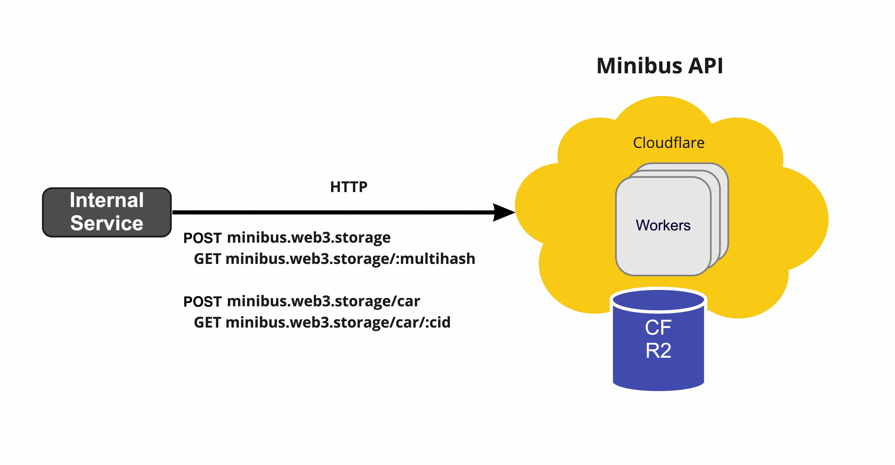

# minibus 🚐

> A edge block service to store IPFS data structures

## Getting started

One time set up of your cloudflare worker subdomain for dev:

- `npm install` - Install the project dependencies from the monorepo root directory
- Sign up to Cloudflare and log in with your default browser.
- `npm i @cloudflare/wrangler -g` - Install the Cloudflare wrangler CLI
- `wrangler login` - Authenticate your wrangler cli; it'll open your browser.
- Copy your cloudflare account id from `wrangler whoami`
- Update `wrangler.toml` with a new `env`. Set your env name to be the value of `whoami` on your system you can use `pnpm start` to run the worker in dev mode for you.

  [**wrangler.toml**](./wrangler.toml)

  ```toml
  [env.bobbytables]
  workers_dev = true
  account_id = "<what does the `wrangler whoami` say>"
  ```

- Add secrets

  ```sh
    wrangler secret put SENTRY_DSN --env $(whoami) # Get from Sentry (not required for dev)
    wrangler secret put LOGTAIL_TOKEN --env $(whoami) # Get from Logtail
    wrangler secret put SECRET --env $(whoami) # open `https://csprng.xyz/v1/api` in the browser and use the value of `Data`
  ```

- Add R2 bucket (Note that it is only available as Private Beta at the time of writing)

  ```sh
  wrangler r2 bucket create blockstore --env $(whoami)
  # 🌀  Creating bucket "blockstore"
  # ✨  Success!
  ```

- `npm run publish` - Publish the worker under your env. An alias for `wrangler publish --env $(whoami)`
- `npm dev` - Run the worker in dev mode. An alias for `wrangler dev --env $(whoami)`

You only need to `npm dev` for subsequent runs. PR your env config to the `wrangler.toml` to celebrate 🎉

## High level architecture

The Edge HTTP internal API to store IPFS data structures on R2.



## Usage

You can see full HTTP API specification at https://web3.storage/block-service-docs.

### 🔒 `POST /`

> Store individuals blocks by multihash in R2.

```sh
echo -e '{"hello":"world"}' | curl -X POST  -H 'Authorization: Basic ACCESS_KEY=' --data-binary @- https://minibus.web3.storage
```

### 🔒 `GET /:multihash`

> Multihash block read interface.

The block data is retrieved and discovered by multihash, in order to enable the same data to be referred to with different codecs.

```sh
curl -X GET -H 'Authorization: Basic ACCESS_KEY' https://minibus.web3.storage/bciqjhirzogurjzpkzpykrusrktg2gcodyhds7o4zctkhyyhtznublca
```

## Authentication

Minibus uses HTTP basic token for authentication. A secret needs to be provided and must correspond to the secret injected in the worker.

The TOKEN needed can be found in 1password vault for web3.storage project.

For development, Miniflare can be used to run this worker. A global with TOKEN should be injected in order to allow creation of dev tokens.

## Contributing

Feel free to join in. All welcome. [Open an issue](https://github.com/web3-storage/edge-block-service/issues)!

## License

Dual-licensed under [MIT + Apache 2.0](https://github.com/web3-storage/edge-block-service/blob/main/LICENSE.md)
